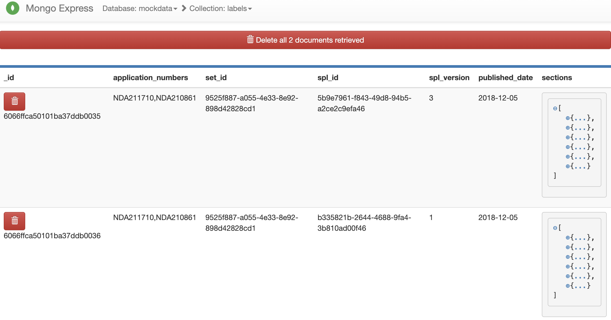

# scoring_data_processor
This package maps changes in drug label to patent claims using the Orange Book Table's of Exclusivity.

Running this package without any optional argument will calculate and store diffs between adjacent labels (by date) for
each drug as defined by NDA number(s) into the label collection of the MongoDB database. The diffs will also be collated to patent claims from the patents collection of the MongoDB database. Labels that are already processed are stored in `resources/processed_log/processed_id_diff.csv` and `resources/processed_log/processed_id_similarity.csv`. These labels will not be re-processed unless optional argument `-r` is set. Running optional arguments other than `-r` will not additionally run the diffing steps or diffs-to-patent-claims mapping unless those flags are set.

##Changes to the Label Collection

Regarding the label collection, this package adds the the following information to labels stored in a MongoDB database:

```
previous_label_published_date: null,
previous_label_spl_id: null,
previous_label_spl_version: null,
next_label_published_date: '2019-07-24',
next_label_spl_id: '0c01a1fd-afc2-4c3e-9d5a-5000fa5a9339',
next_label_spl_version: '2',
diff_against_previous_label: [
    {
        name: '1 INDICATIONS AND USAGE',
        text: [
            [
                1,
                'DRIZALMA Sprinkle is indicated for the treatment of:\n•Major Depressive Disorder in adults [see Clinical Studies (14.1)]\n•Generalized Anxiety Disorder in adults and pediatric patients 7 years to 17 years old [see Clinical Studies (14.2)]\n•Diabetic Peripheral Neuropathy in adults [see Clinical Studies (14.3)]\nChronic Musculoskeletal Pain in adults [see Clinical Studies (14.4)]',
                '0',
                {
                    expanded_content: 'DRIZALMA Sprinkle is indicated for the treatment of:\n•Major Depressive Disorder in adults [see Clinical Studies (14.1)]\n•Generalized Anxiety Disorder in adults and pediatric patients 7 years to 17 years old [see Clinical Studies (14.2)]\n•Diabetic Peripheral Neuropathy in adults [see Clinical Studies (14.3)]\nChronic Musculoskeletal Pain in adults [see Clinical Studies (14.4)]',
                    scores: [
                        {
                            patent_number: '9839626',
                            claim_number: 16,
                            parent_claim_numbers: [],
                            score: 0.4180474579334259
                        },
                        ...
                    ]
                 },
                 ...
             ],
             ...
          ]
    },
    ...
]
additions: {
        '0': {
            expanded_content: 'DRIZALMA Sprinkle is indicated for the treatment of:\n•Major Depressive Disorder in adults [see Clinical Studies (14.1)]\n•Generalized Anxiety Disorder in adults and pediatric patients 7 years to 17 years old [see Clinical Studies (14.2)]\n•Diabetic Peripheral Neuropathy in adults [see Clinical Studies (14.3)]\nChronic Musculoskeletal Pain in adults [see Clinical Studies (14.4)]',
            scores: [
                {
                    patent_number: '9839626',
                    claim_number: 16,
                    parent_claim_numbers: [],
                    score: 0.4180474579334259
                },
                ...
               ]
            },
        ...
}
nda_to_patent: [
    {
        application_number: '212516',
        patents: [
            '10413525',
            '9839626'
        ]
    }
]

```

`diff_against_previous_label` includes all changes versus the previous label for the same set-id.

Note that the first index of each element of `text` within `diff_against_previous_label` indicates whether diff_against_previous_label is an addition `1`, subtraction `-1`, or no change `0` relative to the previous labeled with the same set-id.

The second index of each element of `text` within `diff_against_previous_label` indicates the actual text in question.

The third index of each element of `text` within `diff_against_previous_label` refers to the key in `additions`

The fourth index of each element of `text` within `diff_against_previous_label` copies the value of `additions` for the key in the third index of each element of `text` within `diff_against_previous_label`.  This is a request from the front end developers to ease development.

`additions` stores all additions by a key, which is the value in the third index of each element of `text` within `diff_against_previous_label`.

`expanded_context` refers to the text within the second index of each element of `text` within `diff_against_previous_label`, when the first index of each element of `text` within `diff_against_previous_label` is 1, but is expanded in some cases to include up to the start and end of the sentence surrounding the second index of each element of `text` within `diff_against_previous_label`.  For example, if the addition were just one word, expanded context will include the entire sentence which has that word.

`scores` list the related claim for each addition in order from highest to lowest scoring claim for all related `patent_numbers`.  The related `patent_number` are determined by an Orange Book lookup.

`nda_to_patent` lists all related patent for each NDA number.


## MongoDB Set Up
The connection info for the Mongo DB instance is set in the `.env` file. This should work for a standard MongoDB set up on localhost. If using a different set of DB configs, this file must be updated.

A sample docker set up for mongo, that maps to `localhost:27017` can be found [here](https://github.com/pharmaDB/etl_pipeline). This set up also includes the Mongo Express viewer.



To load the json collection files into the docker container, after running `docker-compose up` per the docker and MongoDB setup [here](https://github.com/pharmaDB/etl_pipeline), find the docker container using `docker ps -a`.  Assuming that `docker ps -a` indicates that `mongo_local` is the name of the docker container that is running MongoDB, then confirm that `MONGODB_HOST` and `MONGODB_PORT` from `.env` matches the address and port underneath `PORTS` of `docker ps -a` for `mongo_local`.

Then you may use either of the following two sets of commands to loads the test collections into the databases:

```
docker cp resources/database_latest/labels.json mongo_local:.
docker cp resources/database_latest/patents.json mongo_local:.
docker cp resources/database_latest/orange_book.json mongo_local:.


docker exec -it mongo_local sh
mongoimport --db latest --collection labels --file labels.json
mongoimport --db latest --collection labels --file patents.json
mongoimport --db latest --collection labels --file patents.json
```
or 

Change `MONGODB_NAME` to `latest` in `.env`.  Then run `python3 main.py -rip -ril -rio` once the Install instructions below are completed.  This will load the `resources/database_latest/` collections into MongoDB.  **(Warning: `python3 main.py -rip -ril -rio` is for the import of collections during testing and development period, and should not be used for production!  In production, the databases are already populated, by scripts from other repositories.  In which case, this module merely performs the diffing and similarity comparisons on data that is already stored on MongoDB.)**

## Running the Code
Requires a minimum python version of `3.6` to run.

### Install

To install:

`pip3 install -r requirements.txt`

or

`pipenv install`

If `pipenv` is used all subsequent `python3` commands should be replaced with `pipenv run python`.

### Usage Examples

To run sequential label diff and similarity comparisons of diffs to patent claims (from scratch):

`python3 main.py -r`

If `-r` is omitted, labels that have already been processed and stored in `resources/processed_log` with not be reprocessed.

To download latest Orange Book:

`python3 main.py -ob`

To output a list of all NDA numbers from the Orange Book:

`python3 main.py -an <filename>`

To output a list of all patents from the Orange Book:

`python3 main.py -ap <filename>`

To output a list of all patents from the Orange Book as a json file:

`python3 main.py -apj <filename>`

To output a list of missing NDA from the database that are in the Orange Book:

`python3 main.py -mn <filename>`

To output a list of missing patents from the database that are in the Orange Book:

`python3 main.py -mp <filename>`

To output a list of missing patents from the database that are in the Orange Book as a json file:

`python3 main.py -mpj <filename>`

These outputs will require confirmation if the file already exists, so use the following to output all files into the `asset/` directory:

`yes | python3 main.py -ob -an -ap -apj -mn -mp -mpj`


To read help:

`python3 main.py -h`


## Exporting Database

### Export To Folder

To output all addition and patent claim set from the database excluding all scores into folders.

`python3 main.py -db2file <folder_name>`

If `<folder_name>` is not set, file is stored in the `analysis` folder.

Alternatively, a compressed version of the export with stale data is located at `analysis/db2file.tar.gz`

### Export To CSV (Zipped)

To output all addition and patent claim set from the database including all scores into a single `.csv` file.

`python3 main.py -db2csv <filename>`

The `<filename>` is optional.  If not set folder is stored in `/resources/hosted_folder/db2csv.zip`.

A compressed version of the export with stale data is located at `resources/hosted_folder/db2csv.zip`

### Hosting CSV (Zipped)

The zipped file can be hosted on a webserver that can be started with:

`sudo nohup python3 server.py &`

## Running the Tests

Unit tests are run with:


`python3 -m unittest`


## Code Formatting
It is recommended to use the [Black Code Formatter](https://github.com/psf/black) which can be installed as a plugin for most IDEs. `pyproject.toml` holds the formatter settings.
